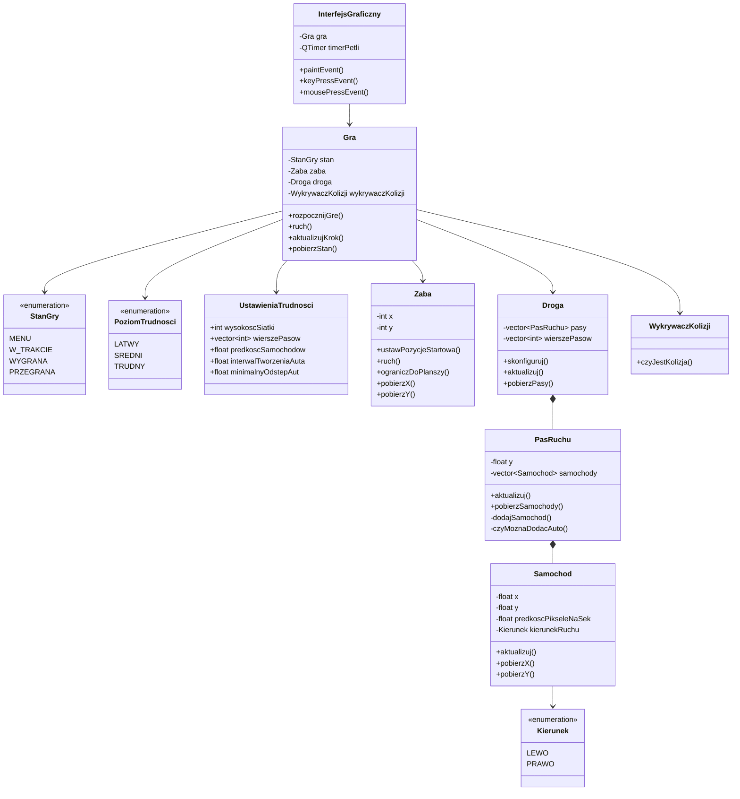

# Dokumentacja opisowa projektu „Żaba na ulicy”

**Przedmiot:** Programowanie 2 — Programowanie obiektowe w C++  
**Temat:** Gra typu Frogger — żaba przechodzi przez ruchliwą ulicę  
**Technologie:** C++17, Qt 6 Widgets, CMake, CTest  
**Repozytorium:** https://github.com/martynablaszak618-ai/zaba

**Przewodniki po kodzie (linia po linii):**
- `PRZEWODNIK_PLIKI_H.md` — pliki nagłówkowe (z komentarzami Doxygen)
- `PRZEWODNIK_PLIKI_CPP.md` — pliki źródłowe i testy

---

## Spis treści

1. [Założenia projektu](#1-założenia-projektu)
2. [Model wymagań](#2-model-wymagań)
3. [Sytuacje wyjątkowe i szczególne](#3-sytuacje-wyjątkowe-i-szczególne)
4. [Koncepcja GUI i opis realizacji](#4-koncepcja-gui-i-opis-realizacji)
5. [Diagram klas i projekt szczegółowy](#5-diagram-klas-i-projekt-szczegółowy)
6. [Plan testów i wyniki](#6-plan-testów-i-wyniki)
7. [Podsumowanie implementacji](#7-podsumowanie-implementacji)
8. [Zrzuty ekranu](#8-zrzuty-ekranu)
9. [Paradygmaty OOP w projekcie](#9-paradygmaty-oop-w-projekcie)

---

## 1. Założenia projektu

### 1.1. Etap 0 — wstępne założenia (plan)

| Założenie | Opis |
|---|---|
| Temat | Klasyczna gra zręcznościowa: żaba musi przejść przez drogę z ruchem samochodów |
| Platforma | Aplikacja desktopowa z graficznym interfejsem użytkownika |
| Język | C++ z wykorzystaniem programowania obiektowego |
| Podział warstw | Logika gry oddzielona od warstwy prezentacji (GUI) |
| Poziomy trudności | Co najmniej 3 warianty rozgrywki |
| Sterowanie | Klawiatura — proste i intuicyjne |
| Testowalność | Możliwość uruchomienia logiki bez pełnego GUI |
| Dokumentacja | Komentarze w kodzie (Doxygen) + dokumentacja opisowa |

### 1.2. Realizacja końcowa — co zostało zbudowane

| Założenie | Realizacja |
|---|---|
| Gra Frogger | Klasa `Gra` + obiekty `Zaba`, `Droga`, `PasRuchu`, `Samochod` |
| GUI | `InterfejsGraficzny` (Qt Widgets), okno 960×720 px |
| 3 poziomy | Łatwy (4 pasy), Średni (8 pasów + trawa), Trudny (12 pasów) |
| Sterowanie | `W/A/S/D`, `Escape` → powrót do menu |
| Logika bez GUI | Program `testy_logiki` (CTest) testuje klasę `Gra` |
| Dokumentacja | Pliki w `docs/`, komentarze Doxygen w `.h`, przewodniki linia po linii |

### 1.3. Cele funkcjonalne (uzgodnione)

1. Menu główne z wyborem poziomu trudności.
2. Plansza z pasami ruchu, trawą (bezpiecznymi strefami) i metą.
3. Automatyczny ruch samochodów z losową dynamiką.
4. Wykrywanie kolizji żaby z autem → przegrana.
5. Dotarcie na metę → wygrana.
6. Ekran końcowy z czasem gry i powrotem do menu.
7. Licznik czasu rozgrywki.

---

## 2. Model wymagań

### 2.1. Wymagania funkcjonalne

| ID | Wymaganie | Priorytet | Status | Implementacja |
|---|---|---|---|---|
| F1 | Wybór poziomu trudności z menu | Wysoki | ✅ | `InterfejsGraficzny::mousePressEvent`, `Gra::rozpocznijGre` |
| F2 | Ruch żaby po siatce (góra/dół/lewo/prawo) | Wysoki | ✅ | `Zaba::ruch`, `Gra::ruch`, `keyPressEvent` |
| F3 | Ograniczenie ruchu do planszy | Wysoki | ✅ | `Zaba::ograniczDoPlanszy` |
| F4 | Automatyczny ruch samochodów | Wysoki | ✅ | `Samochod::aktualizuj`, `PasRuchu::aktualizuj` |
| F5 | Spawn aut z zachowaniem odstępów | Wysoki | ✅ | `PasRuchu::czyMoznaDodacAuto`, `dodajSamochod` |
| F6 | Kolizja z autem → przegrana | Wysoki | ✅ | `WykrywaczKolizji::czyJestKolizja` |
| F7 | Wejście na metę → wygrana | Wysoki | ✅ | `Gra::sprawdzWarunkiKonca`, `pobierzWierszMety` |
| F8 | Ekran końcowy z wynikiem | Średni | ✅ | `rysujEkranKoncowy` |
| F9 | Powrót do menu | Średni | ✅ | `Gra::przejdzDoMenu`, przycisk / Escape |
| F10 | Licznik czasu gry | Średni | ✅ | `Gra::pobierzCzasSekundy` |
| F11 | Różne parametry poziomów | Średni | ✅ | `UstawieniaTrudnosci`, `pobierzUstawieniaTrudnosci` |
| F12 | Brak kolizji na trawie | Średni | ✅ | `czyWierszJestPasem` w detektorze kolizji |

### 2.2. Wymagania niefunkcjonalne

| ID | Wymaganie | Status | Uwagi |
|---|---|---|---|
| NF1 | Programowanie obiektowe (4 paradygmaty) | ✅ | Patrz sekcja 9 |
| NF2 | Oddzielenie logiki od GUI | ✅ | `Gra` nie używa Qt |
| NF3 | Podział na moduły (.h / .cpp) | ✅ | 9 klas + `Typy.h` |
| NF4 | Odporność na sytuacje szczególne | ✅ częściowo | Obrona przez walidację, bez `try/catch` |
| NF5 | Testy automatyczne | ✅ | `tests/TestyLogiki.cpp`, CTest |
| NF6 | Dokumentacja Doxygen | ✅ | `Doxyfile`, komentarze w `.h` |
| NF7 | Przyjazny interfejs | ✅ | Menu, status, czytelne komunikaty |

### 2.3. Macierz śledzenia (wymaganie → klasa)

| Wymaganie | Klasy |
|---|---|
| Stan gry, pętla, zegar | `Gra` |
| Gracz | `Zaba` |
| Pojazdy | `Samochod`, `PasRuchu`, `Droga` |
| Kolizje | `WykrywaczKolizji` |
| Konfiguracja poziomów | `UstawieniaTrudnosci`, `Typy` |
| Prezentacja | `InterfejsGraficzny` |

---

## 3. Sytuacje wyjątkowe i szczególne

### 3.1. Etap 1.a — planowane sytuacje

| Sytuacja | Planowane zachowanie |
|---|---|
| Żaba na krawędzi planszy | Nie wychodzi poza siatkę |
| Żaba na trawie | Brak kolizji z autami |
| Pusty pas ruchu | Automatyczne dołożenie auta |
| Zbyt blisko spawnu | Brak nowego auta (kolizja zapobieżona) |
| Wyjście auta poza ekran | Zawijanie pozycji (pętla pasa) |
| Ruch poza stanem gry | Ignorowanie sterowania |
| Pusta lista pasów w configu | Wartość domyślna ostatniego pasa |

### 3.2. Realizacja w kodzie

| Sytuacja | Mechanizm | Plik |
|---|---|---|
| Wyjście poza planszę | `std::clamp` na x, y | `Zaba.cpp` |
| Kolizja tylko na drodze | `czyWierszJestPasem` → `return false` | `WykrywaczKolizji.cpp` |
| Pusty pas | `utrzymijWidocznyRuch` | `PasRuchu.cpp` |
| Kolizja przy spawnie | `czyMoznaDodacAuto` | `PasRuchu.cpp` |
| Auta za daleko poza ekranem | `normalizujPozycjeAut`, `znormalizujX` | `PasRuchu.cpp` |
| Sterowanie w menu / po grze | `if (stan != W_TRAKCIE) return` | `Gra.cpp`, `keyPressEvent` |
| Pusta lista pasów | `wysokoscSiatki - 2` | `UstawieniaTrudnosci.cpp` |
| Nieznany poziom trudności | Domyślny `UstawieniaTrudnosci{}` | `UstawieniaTrudnosci.cpp` |
| Podwójne zatrzymanie zegara | Flaga `zegarZatrzymany` | `Gra.cpp` |

**Uwaga:** Projekt nie używa mechanizmu wyjątków C++ (`throw` / `try` / `catch`). Odporność realizowana jest przez programowanie defensywne: warunki brzegowe, wartości domyślne i wczesne wyjścia z funkcji. Jest to zgodne z dobrymi praktykami dla gry bez operacji I/O na plikach sieciowych.

---

## 4. Koncepcja GUI i opis realizacji

### 4.1. Koncepcja (etap 0 / 1.a)

```
┌─────────────────────────────────────┐
│         ŻABA NA ULICY               │
│     Wybierz poziom trudności        │
│                                     │
│         [ Łatwy ]                   │
│         [ Średni ]                  │
│         [ Trudny ]                  │
└─────────────────────────────────────┘

┌─────────────────────────────────────┐
│  ░░░ meta (trawa) ░░░░░░░░░░░░░░░░  │
│  ═══ pas 1 (auta →) ══════════════  │
│  ═══ pas 2 (auta ←) ══════════════  │
│  ░░░ trawa (bezpieczna) ░░░░░░░░░░  │
│  ═══ pas 3 (auta →) ══════════════  │
│  ░░░ start (trawa)  🐸 ░░░░░░░░░░░  │
├─────────────────────────────────────┤
│ Poziom: X | Czas: Y s | W/A/S/D     │
└─────────────────────────────────────┘

┌─────────────────────────────────────┐
│         WYGRANA / PRZEGRANA         │
│         Czas gry: XX s              │
│      [ Powrót do menu ]             │
└─────────────────────────────────────┘
```

### 4.2. Realizacja finalna

| Element koncepcji | Realizacja | Szczegóły |
|---|---|---|
| Menu z 3 przyciskami | ✅ | `rysujMenu`, prostokąty `QRect` |
| Plansza wyśrodkowana | ✅ | `offsetX` w `rysujRozgrywke` |
| Naprzemienne kierunki pasów | ✅ | `Droga::skonfiguruj`, `i % 2` |
| Trawa między drogami | ✅ | Wiersze spoza `wierszePasow` |
| Pasek statusu | ✅ | Dolne 60 px okna |
| Nakładka końcowa | ✅ | Półprzezroczysty `rysujEkranKoncowy` |
| Odświeżanie ~60 FPS | ✅ | `QTimer` 16 ms |

### 4.3. Stany interfejsu

| Stan (`StanGry`) | Co widzi użytkownik | Interakcja |
|---|---|---|
| `MENU` | Tytuł + 3 przyciski | Klik myszą |
| `W_TRAKCIE` | Plansza + status | W/A/S/D, Escape |
| `WYGRANA` | Plansza + zielony napis + przycisk | Klik „Powrót” |
| `PRZEGRANA` | Plansza + czerwony napis + przycisk | Klik „Powrót” |

---

## 5. Diagram klas i projekt szczegółowy

### 5.1. Diagram klas (finalny)



### 5.2. Odpowiedzialność głównych klas

| Klasa | Odpowiedzialność (SRP) |
|---|---|
| `Gra` | Orkiestracja stanu, czasu, ruchu i warunków końca |
| `Zaba` | Pozycja i ruch gracza |
| `Samochod` | Ruch jednego auta |
| `PasRuchu` | Zarządzanie autami na jednym pasie |
| `Droga` | Zbiór pasów, konfiguracja z poziomu trudności |
| `WykrywaczKolizji` | Test zderzenia żaby z autem |
| `UstawieniaTrudnosci` | Parametry liczbowe poziomów |
| `InterfejsGraficzny` | Okno Qt, rysowanie, wejście użytkownika |
| `Typy` | Wspólne typy wyliczeniowe |

### 5.3. Przepływ danych (uproszczony)

```
Użytkownik (klawiatura/mysz)
        ↓
InterfejsGraficzny
        ↓
Gra::ruch / rozpocznijGre / aktualizujKrok
        ↓
Zaba, Droga → PasRuchu → Samochod
        ↓
WykrywaczKolizji → stan WYGRANA/PRZEGRANA
        ↓
InterfejsGraficzny::paintEvent → ekran
```

---

## 6. Plan testów i wyniki

### 6.1. Plan testów (etap 1)

| ID testu | Cel | Typ | Wejście | Oczekiwany wynik |
|---|---|---|---|---|
| T1 | Poprawność configu poziomów | Jednostkowy | `pobierzUstawieniaTrudnosci` | Łatwy: 4 pasy, Średni: 8, Trudny: 12 |
| T2 | Rosnąca trudność | Jednostkowy | Porównanie prędkości | latwy < sredni < trudny |
| T3 | Granice planszy Y | Integracyjny | 10× ruch w dół | Y = 0 |
| T4 | Granice planszy X | Integracyjny | 100× ruch w lewo | X = 0 |
| T5 | Brak kolizji na trawie | Integracyjny | Żaba na wierszu 3, 120 klatek | Stan = W_TRAKCIE |
| T6 | Wygrana na mecie (łatwy) | Integracyjny | Ruch do wiersza mety | Stan = WYGRANA |
| T7 | Brak wygranej na ostatnim pasie | Integracyjny | Ruch do ostatniego pasa drogi | Stan = W_TRAKCIE |
| T8 | Wygrana na mecie (średni) | Integracyjny | Ruch + aktualizujKrok | Y = wiersz mety, WYGRANA |

### 6.2. Implementacja testów

Plik: `tests/TestyLogiki.cpp`  
Uruchomienie:

```bash
cmake -S . -B build -DCMAKE_PREFIX_PATH="/usr/local/opt/qt"
cmake --build build
ctest --test-dir build --output-on-failure
```

### 6.3. Testy manualne (prezentacja na żywo)

| Scenariusz | Kroki | Oczekiwany wynik |
|---|---|---|
| M1 Start gry | Klik „Łatwy” | Plansza, żaba na dole, auta jadą |
| M2 Ruch | W/A/S/D | Żaba porusza się o 1 pole |
| M3 Kolizja | Wejście w auto | Ekran PRZEGRANA |
| M4 Wygrana | Dojście na górę (meta) | Ekran WYGRANA + czas |
| M5 Powrót | Klik „Powrót do menu” | Menu główne |
| M6 Poziomy | Średni / Trudny | Więcej pasów, szybsze auta |

### 6.4. Interfejs testowy (logika bez GUI)

Wymaganie projektowe: *„możliwość uruchomienia głównej logiki z interfejsem testowym (tekstowym)”*.

**Realizacja:** program `testy_logiki` linkuje te same pliki `.cpp` logiki co gra (`Gra`, `Zaba`, `Droga`…), ale **bez** `InterfejsGraficzny` i Qt Widgets. Wyniki testów wypisywane są na konsolę (`stdout` / `stderr`).

---

## 7. Podsumowanie implementacji

### 7.1. Struktura repozytorium

```
zaba/
├── include/          # Nagłówki klas (.h)
├── src/              # Implementacje (.cpp) + main.cpp
├── tests/            # Testy logiki (CTest)
├── docs/             # Dokumentacja opisowa i przewodniki
├── Doxyfile          # Konfiguracja Doxygen
├── CMakeLists.txt    # Budowanie gry i testów
└── README.md         # Instrukcja uruchomienia
```

### 7.2. Etapy vs stan końcowy

| Etap (wg PDF) | Wymagany zakres | Status |
|---|---|---|
| 0 | Założenia, wymagania, koncepcja GUI | ✅ Ten dokument, sekcje 1–4 |
| 1.a | Diagram klas, model wymagań, GUI, wyjątki | ✅ Sekcje 2–5 |
| 1 | Projekt szczegółowy, plan testów | ✅ Sekcje 5–6 |
| 2.a | Logika + szkielet GUI | ✅ `Gra` + `InterfejsGraficzny` |
| 2 | Aplikacja + testy + dokumentacja | ✅ |

### 7.3. Środowisko

- **Kompilator:** C++17 (Apple Clang / MSVC z `/utf-8`)
- **GUI:** Qt 6 Widgets
- **Build:** CMake 3.20+, Ninja/Make
- **IDE:** Qt Creator (presety w `CMakePresets.json`)

---

## 8. Zrzuty ekranu

> **Do uzupełnienia przed prezentacją:** zrób zrzuty ekranu działającej gry i umieść je w folderze `docs/screenshots/`.

| Plik | Co pokazać |
|---|---|
| `01_menu.png` | Menu główne z trzema przyciskami |
| `02_rozgrywka_latwy.png` | Rozgrywka — poziom łatwy |
| `03_rozgrywka_sredni.png` | Rozgrywka — poziom średni (trawa między drogami) |
| `04_wygrana.png` | Ekran WYGRANA z czasem |
| `05_przegrana.png` | Ekran PRZEGRANA |
| `06_testy.png` | Wynik `ctest` w terminalu |

**Jak zrobić zrzuty na macOS:** `Cmd + Shift + 4`, zaznacz okno gry.

**Jak zrobić zrzut testów:**

```bash
ctest --test-dir build --output-on-failure | tee docs/screenshots/wynik_testow.txt
```

---

## 9. Paradygmaty OOP w projekcie

| Paradygmat | Gdzie w projekcie |
|---|---|
| **Enkapsulacja** | Pola `private`, publiczne metody dostępu (`pobierzX`, `pobierzStan`) |
| **Abstrakcja** | Klasy modelują pojęcia domenowe (żaba, pas, droga), ukrywają szczegóły |
| **Dziedziczenie** | `InterfejsGraficzny : public QWidget` |
| **Polimorfizm** | `override` metod Qt: `paintEvent`, `keyPressEvent`, `mousePressEvent` |

Dodatkowo:
- **Kompozycja** zamiast głębokiego dziedziczenia: `Gra` zawiera `Zaba`, `Droga`, `WykrywaczKolizji`
- **Rozdział odpowiedzialności:** logika (`Gra`) vs prezentacja (`InterfejsGraficzny`)

---

*Dokument przygotowany do oddania projektu i prezentacji na zajęciach.*
